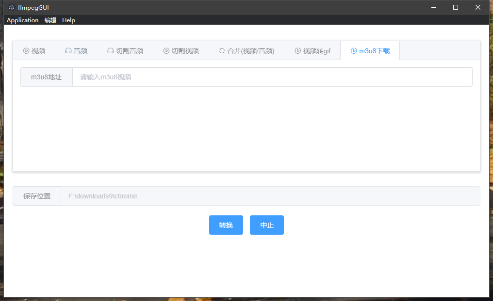

# ffmpegGUI

### 项目说明

基于 electron-vue + ffmpeg 的 GUI

### 项目截图




### 遇到的问题

为了减小打包文件，没有使用ffmpeg-static库，需手动安装ffmpeg并加入环境变量

### 待完善

- [ ] 增加配置项（目前所有的配置默认都是写死的，比如转视频时默认会把任意格式的视频转 MP4）
- [ ] 切割音频和视频时可以实时预览
- [x] 转码核心代码优化
- [ ] 提供可以让用户输入 ffmpeg 命令的形式执行转码操作（目前基本可以实现）
- [ ] 界面优化
- [ ] 用户可选保持原始目录路径
- [ ] 加入文件夹监控，自动队列转码（支持数据库和 webhook）
- [x] 下载 M3u8 的链接
- [ ] 批量转码（指定线程池数量来优化性能）

### 构建应用

```bash
# 安装依赖
yarn

# 热加载服务运行在 localhost: 9080
yarn run dev

# 打包项目
yarn run build
```

